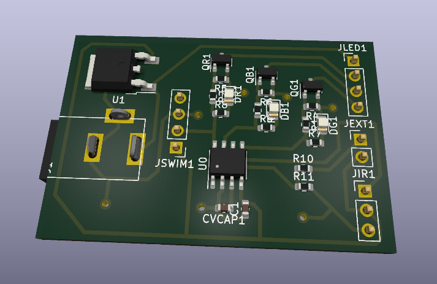
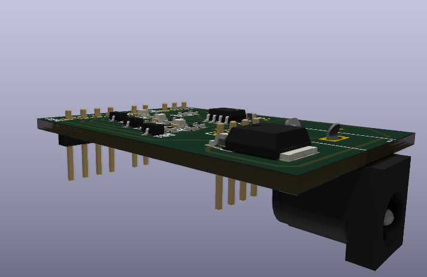
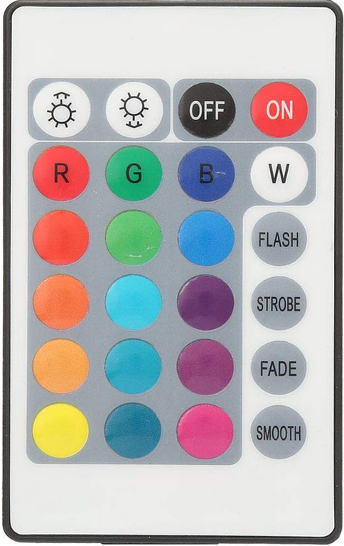

# STM8 RGB LED Strip Controller (Infrared NEC)

Custom low-cost RGB LED strip controller based on STM8, featuring Infrared (NEC protocol) control and perceptually-correct dimming.

## Overview

I bought a Paulmann SimpLED RGB strip to use as a bedside lamp. However, I was not satisfied with its functionalities (RGB light strobes before sleep didn’t make much sense), the colors were too aggressive for my eyes, and the dimming was linear (whereas human vision behaves more like a logarithmic response).

I initially wanted to reflash the original controller, but there were no markings on the IC package. So I decided to rebuild it from scratch.

This redesign addresses those issues with:
- Smooth, perceptually-correct brightness control
- Customizable color profiles
- Infrared remote compatibility (NEC protocol)
- Minimal, low-cost hardware

### Features

- Customizable color mapping
- Smooth, perceptually-correct brightness control
- Customizable color functions (ie: go-to-bed that slowly switch off the lights)
- Drop-in replacement PCB for original enclosure

## Hardware
### PCB Design
The PCB form factor and the position of the power barrel connector are designed to fit into the original controller enclosure and to be powered with the original 12VDC power supply.
I chose to use an STM8S001, as it is inexpensive, low-power, and more than sufficient for this project.

PCB design files are available in the PCB/ directory (KiCad).

### Preview

### Materials
|Name | Value | 	Number	| Comments|
| --- | ----- | ----------- | --------|
|STM8S001J3M3 |	|	1	|https://fr.farnell.com/stmicroelectronics/stm8s001j3m3/mcu-8bit-16mhz-nsoic-8/dp/4036166|
|MC78M05CDTRKG| | 		1|	7805 LDO regulator https://fr.farnell.com/on-semiconductor/mc78m05cdtrkg/regulateur-de-tension/dp/1703354|
|IRLML6344TRPBF	||	3	|N-channel MOSFETs used to control the LEDs https://fr.farnell.com/infineon/irlml6344trpbf/mosfet-canal-n-30v-6-3a-sot23/dp/1857299|
|MJ-179PH|	|	1|	Barrel power connector https://fr.farnell.com/multicomp-pro/mj-179ph/embase-basse-tension-12vdc-4a/dp/1737246|
|TSOP18438	|	|1|	IR receiver (replacement for the original one I broke — this one is actually more powerful) https://fr.farnell.com/vishay/tsop18438/recepteur-ir-24m-0-12mw-m2-lateral/dp/2889952|
|C1|	100 nF	|1|	1608 SMD|
|CVCAP	|1 µF	|1|	1608 SMD|
|R1, R2, R3	|1 kΩ|	3	|Load resistors for the MOSFETs, 1608 SMD|
|R4, R5, R6	|47 kΩ|	3	|Pull-down resistors, 1608 SMD|
|R7, R8, R9	|550 Ω|	3	|Optional load resistors for the LEDs, 1608 SMD|
|R10|	47 kΩ|	1	|Optional pull-down resistor for the JEXT button (not implemented)|
|R11|	1 kΩ	|1|	Load resistor for the optional JEXT button|
|RGB LEDs|	R, G, B|	3|	Optional, for debugging without the LED strip connected, 2012 SMD|
|Pin headers	|	|4	|Used for SWIM programming, IR receiver connection, and LED strip connection|

### IR remote buttons mapping : 

For all the buttons, the NEC Address is `0xef00`. The commands are the following:
| Col A  | Col B  | Col C  | Col D  |
| ------ | ------ | ------ | ------ |
| `0x00` | `0x01` | `0x02` | `0x03` |
| `0x04` | `0x05` | `0x06` | `0x07` |
| `0x08` | `0x09` | `0x0a` | `0x0b` | 
| `0x0c` | `0x0d` | `0x0e` | `0x0f` | 
| `0x10` | `0x11` | `0x12` | `0x13` | 
| `0x14` | `0x15` | `0x16` | `0x17` | 

## Firmware
I wrote the NEC infrared decoder from scratch, mainly for fun. It is built around a finite state machine. The command handler is implemented as a large switch statement.

The firmware is interrupt-driven, aiming to minimize power consumption (although it is not battery-powered).

You can add your own colors in src/config/led_config.c, adjust command codes to match your remote control, and implement additional features.

Since the STM8S001 does not include an FPU, all arithmetic is done using fixed-point math.

I used OpenAI Codex at the end to help refactor parts of the code.

### TODO
Implement features using a button connected to JEXT (e.g., on/off)

### Compile
I use SDCC for compilation. 
usage :
`make clean && make`

flash: I used a stlinkv2 with a SWIM Connector
`make flash`

